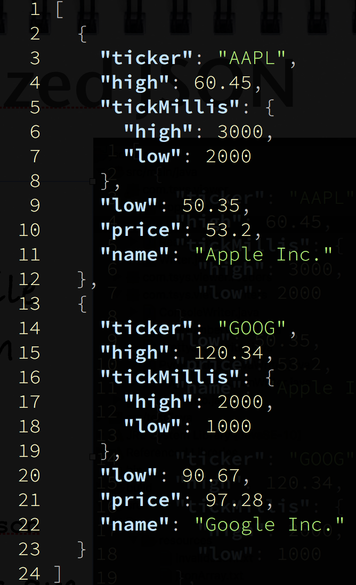

# JSON Viewer Problem

## Example Usage
* ```view [-style] [-n] [-pretty=no] response.json ```
* default is ```-pretty=yes``` or simply ```-pretty```

<center>
  
</center>

## Creating Eclipse and Idea Project files, Building and Running.

### Java9 and above
* To create project Eclipse Project files, run ```gradle -b build9.gradle eclipse``` 
* To create project Idea Project files, run ```gradle -b build9.gradle idea``` 
* To build the project execute ```gradle -b build9.gradle``` 
* To run the project execute ```gradle -b build9.gradle run``` 

#### Using Eclipse Oxygen
Once the project is created, you need to add the following to configure it for using Java9:

* Please refer to the link [https://wiki.eclipse.org/Configure_Eclipse_for_Java_9](https://wiki.eclipse.org/Configure_Eclipse_for_Java_9)
* Add the following lines in your ```eclipse.ini``` file.  ```--add-modules=ALL-SYSTEM``` after the ```vm``` property.  Refer to [www.journaldev.com/10882/eclipse-ini-vm-arguments-file-location-mac-windows](https://www.journaldev.com/10882/eclipse-ini-vm-arguments-file-location-mac-windows) for setting it up.
* Start Eclipse
* Next, we need to add the dependent jars (in our case, JSON jar, JCDP and Commons CLI) on the module path.  So, go to Project properties, then go to Java Build Path, and under Classpath, expand the twisty for each jar that you want to be a module. You should see a new entry called "Is not modular". Click on it and click the Edit button. Under the Modular properties dialog that opens, check the box "Defines one or more modules". Click OK and it should now say "Is modular" and it will be moved up to Modulepath.

#### Java9 and below
* First delete the ```module-info.java``` present in the folder ``src/main/java``
* To create project Eclipse Project files, run ```gradle eclipse``` 
* To create project Idea Project files, run ```gradle idea``` 
* To build the project execute ```gradle``` 
* To run the project execute ```gradle run``` 

### Using Other languages like Scala, Groovy, Clojure
* You can appropriately add the gradle plugins as per your choice of language in the ```build.gradle```.
* Do not forget to delete ```java``  plugin found therein.

### Running
When you run this, it invokes, application main class, which just prints ```Json Viewer - Lets Begin Implementing!```

## Stories Slide Deck
Stories to be implemented are found on the link [https://www.slideshare.net/DhavalDalal/json-viewer-stories](https://www.slideshare.net/DhavalDalal/json-viewer-stories)


## Project Dependencies
* JSON Java - We will be using Java JSON library.  If you need a primer on how to use this library, please refer to a short tutorial on [http://www.baeldung.com/java-org-json](http://www.baeldung.com/java-org-json).  It can parse JSON text, produce JSON from Map, List and Java Objects (bean style) and can pretty print JSON as well.  If you are comfortable with any other Java JSON library, please feel free to use it, but make sure, you update the project dependencies in ```build.gradle```
* Java Colored Debug Printer (JCDP) - has an easy syntax to print messages with a colored font/background on console (Win, MacOS and Linux based systems).  Look here [https://github.com/dialex/JCDP](https://github.com/dialex/JCDP) for the short primer and the documentation on ReadMe.md is quite sufficient for this project.
* Optionally (though not required) you may want to use Apache Commons command line parsing library -  Commons CLI.  Here is how you can use it [https://commons.apache.org/proper/commons-cli/usage.html](https://commons.apache.org/proper/commons-cli/usage.html)

## Releasing
* Make sure, all your tests run, before releasing your solution.
* It should not happen, that they run only on your machine ;)
* A batch file ```view.bat``` for Windows and ```view.sh``` for Linux based platforms must be included.  This will call Java and pass command line args to it.  If you are using Java9, you need not do this, instead simply use ```JLink``` and produce a custom executable with the name ```view```. 


